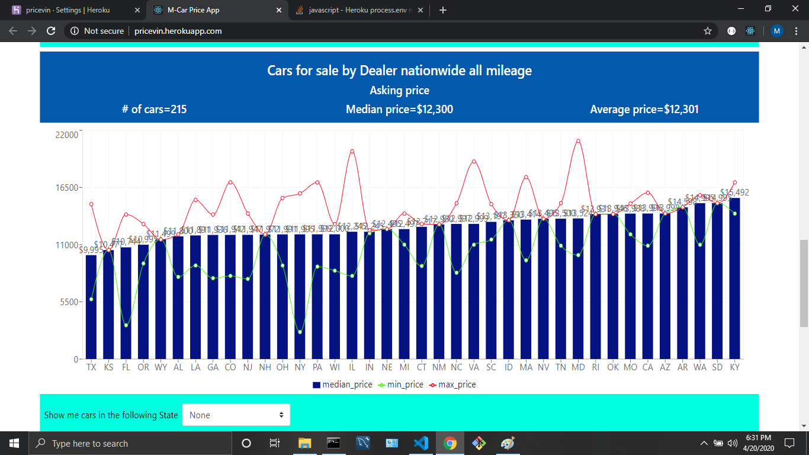

# Purpose of the application

This application is the final project for the Full Stack Programming Bootcamp.  It is a MERN stack using MongoDB for data storage, Express for route management, React as the UI framework and NodeJS as the server-side language.

M-Car is a car price simplification search engine, that allows a user to evaluate what is the market value of a specific vehicles.  The idea is to provide the user with the analytical and search tools to make more informed decisions about vehicle pricing by looking at the market data.  

This application intends to solve the following issues:

* Prices on popular car search engines are not standards:  It is confusing trying to compare pricing when cars come in many different configurations (V6 vrs. L4 engines, turbocharged versus aspirated models, different engine configuration, etc.).  By entering a VIN number, the model searched will be those with similar configurations.  The user doesn't even have to enter the year, brand, model.  This application will decode the VIN and only present similar car models.

* Missing price "arbitrage" opportunities:  Car prices vary tremendously, and by not having nationwide visibility, users might not truly understand whether the same vehicle might be less expensive at other parts of the nation.

* Missing analytical tools for car prices:  While current search engines allow to see what is available, none of them present easy to understand market price analytics as this application does.

#  Data input

This application only needs three parameters to provide all information needed by a car buyer/seller:  1) VIN number, 2) target car mileage, and 3) a zip code.  Brand, configuration, etc, is part of a VIN and therefore implicitely included in the search.

This simplification comes at a cost.  VIN standardization started several years ago, but older models (i.e. 2010 and prior) might see wider fluctuations due to lack of VIN standardization.  As manufacturers continue to standardize and align their model make-up to VIN-encoded attributes, this search engine will be able to provide better and less variant results.

# Data output

Once the user has provided that information, it will return the following data:

* All comparable local cars:  All cars within a 150-mile ratio from the user ZIP code, that falls within a comparable mileage for a car.  For example, if the user is targetting to get a car with 50,000 miles, the application will return all local cars sold by dealers within 150 miles that have between 44,000 and 56,000 miles.  
* All comparable "national" cars:  Same as above, but the 150-mile ration restriction is lifted to all the cars returned by the API provider (see API provider section).  Will still consider the number of miles when presenting those cars by state.
* All similar "national" cars:  Same as above, but the mileage restriction will be lifted so that the user can see a true national search.
* Similar-cars prices based on mileage:  The application will group similar cars (based on VIN attributes) and will classify them into mileage ranges.  The result of each mileage block (median, maximum and minimum price) will be presented.  Mileage blocks will be created in $10K increments.  Therefore, the graph will show all cars with mileage between 0-10K, from 10K to 20K, from 20K to 30K, etc.

The application will only show the "asking price", or what the dealer is selling the car for.  For example, if a dealer is selling a car for $20K, the price for that vehicle will be shown as $20K regardless of the potential cost of moving and delivering the automobile from the dealer lot to the user location.

# Delivered car price option

The user can choose to see the information above, but use the delivery price option.  In this example, if a user is looking at a car that is being sold for $20K three states away, the application will calculate delivery costs and will add them to the asking price.  This price is a true comparison of what a car would cost to the user and compare to local prices.  Delivered price for local cars (those within 150 miles) is the same as the asking price as the application considers that the cost of acquiring the local vehicle will also be present when acquiring a non-local vehicle (phone calls, time used in searching/talking with dealers, etc.).

#  User authentication

This is a restricted applications and potential users need to establish an account prior to access its functionality.  We have used Passport with a local strategy to verify user's credentials.

The collection "users" has been created in MongoDb to store the user e-mail and its password.  Responsibility of authentication remains on the server side.  The client will gather the user data, then will call the server which in turn will authenticate and either deny or confirm a user to continue.  The UI will enforce server's determination by not allowing traffic to any route other than the login screen unless previously verified.

Once the user has been able to log in, a logout button will be available so that the user can leave the application. 

#  Technologies / APIs utilized for this project

In the front-end, we are using React, Material Design-UI, and Bootstrap.  

The back-end users MongoDb, Passport, Express and NodeJS.

The API selected is Marketplace API, one of the largest open automobile for sale databases in the United States and Canada.

##  Deployment to Heroku

This application has been deployed to Heroku at https://kar-marc-price.herokuapp.com/

##  Use of the application and business value

Once the user knows which vehicle wants to price (either to sell one of his/her own or to match a car that will likely be bought), it enters the information including the mileage and the zip code.

The application, in return, will provide the following information:

* A list of all local cars with similar mileage.  This will show the user other alternatives that can be easily compared and researched to ensure that any price is competitive.

* A chart showing all cars by state with similar mileage.  This option will allow the user to see emerging trends in other parts of the country.  Is a model price different at other states?  Is that a viable option based on the distance / cost of delivery?

* A chart showing all cars by state will all mileage.  What cars are available nationwide regardless of mileage?  This is important particularly to those that don't care as much as the mileage or have the mechanical expertise to judge the shape/condition of internal components skipping the mileage heuristic.

* A chart showing how prices for the same model change with mileage.  This is an excellent price-benefit analysis since the user can see the impact of mileage in prices and see whether there is a big steep premium to be paid for a lower-mileage car.

##  Overall application demonstration

